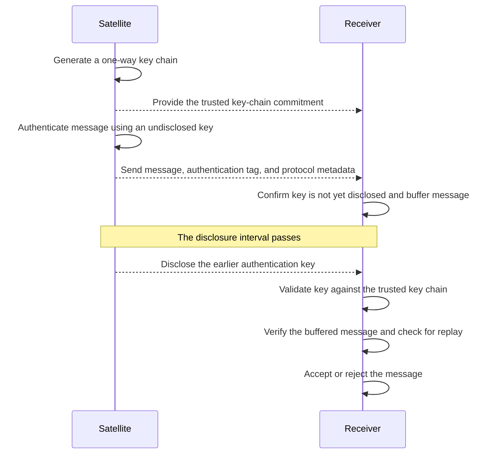

# Technical Challenge: Mini-TESLA Message Authentication

## Overview

The goal of this challenge is to design and implement a simplified **TESLA-based message authentication protocol**.

The cryptographic operations and key material must be encapsulated in an **HSM class** that mimics some of the key-protection properties of a Hardware Security Module.

You will build a **Satellite and Receiver simulator**. The Satellite will create authenticated messages and later disclose their authentication keys, allowing the Receiver to validate the keys and authenticate the buffered messages.

---

## Requirements

### Core Cryptographic Engine

Implement the cryptographic operations in an **HSM class** using appropriate cryptographic libraries for your chosen language.

The HSM must support the following capabilities:

- **Secure Key Generation:** Generate key material using a cryptographically secure source of randomness.
- **One-Way Key Chain:** Generate a SHA-256 key chain and validate disclosed keys against its trusted commitment.
- **Message Authentication:** Generate and verify message authentication codes using HMAC-SHA256.
- **Key Protection:** Keep authentication keys internal during MAC generation and expose them only through an explicit key-disclosure operation.

### Satellite and Receiver

The application must contain two logical participants implemented as separate components:

- A **Satellite** that creates the key chain, authenticates messages, and discloses authentication keys after a delay.
- A **Receiver** that receives and buffers authenticated messages, validates disclosed keys, and then accepts or rejects the buffered messages.

The Satellite and Receiver must each use a separate instance of the **HSM class** for the cryptographic operations they require.

They must use a deterministic byte representation for all message fields protected by the MAC.

The Satellite and Receiver may run within the same application process. They may communicate through direct method calls or through a small demonstration program. A network server, HTTP API, gRPC service, message broker, or external communication channel is not required.

### Authentication Sequence

The expected interaction is shown below:

### Authentication Flow Demonstration

Provide a small demonstration of the sequence shown above.

The demonstration must include:

- A valid message being authenticated after its key is disclosed
- A modified message or authentication tag being rejected
- An invalid disclosed key being rejected
- A previously accepted message being replayed and rejected
- More than one message and disclosure interval being processed

The demonstration script or tests may copy, modify, delay, duplicate, reorder, or replay packets before passing them to the Receiver.

### Persistence & Security at Rest

- **Export/Import:** The HSM must support exporting its key store to a local file and importing it again without using an external database.
- **Encryption at Rest:** The exported file must be encrypted using **AES-256-GCM**.
- **Master Key:** The master encryption key must be passed to the application through an environment variable.

---

## Constraints

- **Language:** Use a programming language of your choice. Clearly document the language version and required dependencies.
- **Cryptography:** Use established cryptographic libraries available for your chosen language. Do not implement cryptographic primitives manually.
- **No External Databases:** Use in-memory state with the required encrypted file-based HSM export/import.
- **Testing:** Use an appropriate automated testing framework for your chosen language.
- **Security:** Undisclosed authentication keys must not be exposed to the Receiver before their disclosure interval.
- **Scope:** The candidate is not expected to implement the complete TESLA or Galileo OSNMA specifications.
- **Time Expectation:** Complete and submit the challenge within **2 calendar days**. If any portion is incomplete, clearly document the intended design and remaining work.

---

## Evaluation Criteria

We will evaluate your submission based on:

- **Security Mindset:** Correct reasoning about secret keys, trust establishment, key disclosure, and attacker-controlled packets.
- **Authentication Protocol:** Correct use of the one-way key chain, HMAC, delayed key disclosure, and replay protection.
- **Key Management:** Secure handling, export, and import of HSM key material.
- **Protocol Design:** Clear handling of intervals, protocol state, and failure conditions.
- **Code Quality:** Idiomatic code in the chosen language, clear project structure, automated tests, and comprehensive error handling.
- **Resilience:** How the Receiver handles malformed packets, modified messages, invalid keys, and replay.

---

## Submission Instructions

1. Everything must be pushed to your **GitHub repository**.
2. Provide a `README.md` explaining the design and how to run the demonstration.
3. Include automated tests and instructions for running them.
