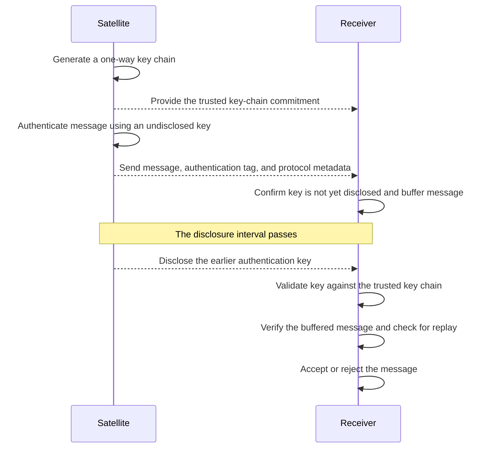

# Technical Challenge: Mini-TESLA Message Authentication

## Overview

The goal of this challenge is to design and implement a simplified **TESLA-based message authentication protocol**.

The cryptographic operations and key material must be encapsulated in an **HSM class** that mimics some of the key-protection properties of a Hardware Security Module.

You will build a **Satellite and Receiver simulator**. The Satellite will create authenticated messages and later disclose their authentication keys, allowing the Receiver to validate the keys and authenticate the buffered messages.

---

## Requirements

### Core Cryptographic Engine

Implement the cryptographic operations in an **HSM class** using appropriate cryptographic libraries for your chosen language.

The HSM must support the following capabilities:

- **Secure Key Generation:** Generate key material using a cryptographically secure source of randomness.
- **One-Way Key Chain:** Generate a SHA-256 key chain and validate disclosed keys against its trusted commitment.
- **Message Authentication:** Generate and verify message authentication codes using HMAC-SHA256.
- **Key Protection:** Keep authentication keys internal during MAC generation and expose them only through an explicit key-disclosure operation.

### Satellite and Receiver

The application must contain two logical participants implemented as separate components:

- A **Satellite** that creates the key chain, authenticates messages, and discloses authentication keys after a delay.
- A **Receiver** that receives and buffers authenticated messages, validates disclosed keys, and then accepts or rejects the buffered messages.

The Satellite and Receiver must each use a separate instance of the **HSM class** for the cryptographic operations they require.

They must use a deterministic byte representation for all message fields protected by the MAC.

The Satellite and Receiver may run within the same application process. They may communicate through direct method calls or through a small demonstration program. A network server, HTTP API, gRPC service, message broker, or external communication channel is not required.

### Authentication Sequence

The expected interaction is shown below:



### Authentication Flow Demonstration

Provide a small demonstration of the sequence shown above.

The demonstration must include:

- A valid message being authenticated after its key is disclosed
- A modified message or authentication tag being rejected
- An invalid disclosed key being rejected
- A previously accepted message being replayed and rejected
- More than one message and disclosure interval being processed

The demonstration script or tests may copy, modify, delay, duplicate, reorder, or replay packets before passing them to the Receiver.

### Persistence & Security at Rest

- **Export/Import:** The HSM must support exporting its key store to a local file and importing it again without using an external database.
- **Encryption at Rest:** The exported file must be encrypted using **AES-256-GCM**.
- **Master Key:** The master encryption key must be passed to the application through an environment variable.

---

## Constraints

- **Language:** Use a programming language of your choice. Clearly document the language version and required dependencies.
- **Cryptography:** Use established cryptographic libraries available for your chosen language. Do not implement cryptographic primitives manually.
- **No External Databases:** Use in-memory state with the required encrypted file-based HSM export/import.
- **Testing:** Use an appropriate automated testing framework for your chosen language.
- **Security:** Undisclosed authentication keys must not be exposed to the Receiver before their disclosure interval.
- **Scope:** The candidate is not expected to implement the complete TESLA or Galileo OSNMA specifications.
- **Time Expectation:** Complete and submit the challenge within **2 calendar days**. If any portion is incomplete, clearly document the intended design and remaining work.

---

## Evaluation Criteria

We will evaluate your submission based on:

- **Security Mindset:** Correct reasoning about secret keys, trust establishment, key disclosure, and attacker-controlled packets.
- **Authentication Protocol:** Correct use of the one-way key chain, HMAC, delayed key disclosure, and replay protection.
- **Key Management:** Secure handling, export, and import of HSM key material.
- **Protocol Design:** Clear handling of intervals, protocol state, and failure conditions.
- **Code Quality:** Idiomatic code in the chosen language, clear project structure, automated tests, and comprehensive error handling.
- **Resilience:** How the Receiver handles malformed packets, modified messages, invalid keys, and replay.

---

## Submission Instructions

1. Everything must be pushed to your **GitHub repository**.
2. Provide a `README.md` explaining the design and how to run the demonstration.
3. Include automated tests and instructions for running them.


---

# Candidate Solution — Girish Nallan Chakravathy

This fork preserves the original challenge statement above and adds a complete Python implementation of the requested simplified TESLA-style authentication flow.


## Quick start — run and verify the solution

The implementation runs **locally** with Python **3.11, 3.12, or 3.13** (the versions exercised by CI). You need Git and Python; no server, network service, or database is required. Run the commands below from a terminal.

### Linux / macOS (bash or zsh)

```bash
git clone https://github.com/Girish2052003/Girish-Nallan-Chakravathy-mini-tesla-authentication-challenge.git
cd Girish-Nallan-Chakravathy-mini-tesla-authentication-challenge
python3 -m venv .venv
source .venv/bin/activate
python -m pip install -e '.[dev]'

python demo.py
python -m pytest -q
python verification/check_invariants.py
```

### Windows (PowerShell)

```powershell
git clone https://github.com/Girish2052003/Girish-Nallan-Chakravathy-mini-tesla-authentication-challenge.git
cd Girish-Nallan-Chakravathy-mini-tesla-authentication-challenge
py -3.11 -m venv .venv
.\.venv\Scripts\python.exe -m pip install -e ".[dev]"

.\.venv\Scripts\python.exe demo.py
.\.venv\Scripts\python.exe -m pytest -q
.\.venv\Scripts\python.exe verification/check_invariants.py
```

If you installed Python 3.12 or 3.13 instead, substitute `-3.12` or `-3.13` in the Windows environment-creation command. PowerShell commands use the virtual environment's Python directly, so activating PowerShell scripts is unnecessary.

### What to expect

| Command | What it demonstrates | Successful result |
| --- | --- | --- |
| `python demo.py` | Satellite → Receiver delayed disclosure, valid messages, tampering, bad keys, replay and multiple intervals | Valid packets show `ACCEPT`; deliberately invalid cases show `REJECT` |
| `python -m pytest -q` | Automated functional and adversarial regression tests | Pytest finishes with all tests passing (exit code 0) |
| `python verification/check_invariants.py` | Finite timing-input grids and fixed replay/forgery traces against the Python implementation | Prints `Finite implementation checks passed` (exit code 0) |

**Additional model-checking evidence:** An independent finite TLA+ model, including expected attack counterexamples, is explained in [VERIFICATION.md](VERIFICATION.md) and [the model-specific run guide](verification/model/README.md). The GitHub Actions [test workflow](.github/workflows/tests.yml) runs the Python tests, finite checks, and pinned TLA+ model automatically.

**Secrets:** The demo and regression tests do not need you to set a permanent master key manually. For your **own encrypted HSM export/import** experiment, set the `MINITESLA_MASTER_KEY` environment variable as described in [HSM persistence](#hsm-persistence). Never commit a real master key or encrypted state file.

For the reproducible **hash-locked dependency installation used by CI**, see [Audit hardening and operational assumptions](#audit-hardening-and-operational-assumptions).

---


## Implementation summary

The solution uses:

- Python 3.11+
- SHA-256 for the one-way key chain
- HMAC-SHA256 for message authentication
- AES-256-GCM for encrypted HSM state export/import
- the Python cryptography package for HMAC and AES-GCM
- pytest for automated tests

The implementation is intentionally small and explicit. The Satellite and Receiver use separate HSM instances. The satellite-side HSM owns the undisclosed authentication keys; the receiver-side HSM starts with only the trusted key-chain commitment and learns interval keys only through validated disclosure.


## Requirement coverage at a glance

| Challenge requirement | Where to verify it |
| --- | --- |
| CSPRNG key generation | `HSM.create_satellite()` uses `secrets.token_bytes()` |
| SHA-256 one-way key chain | `HSM.create_satellite()` and `validate_and_store_disclosed_key()` |
| HMAC-SHA256 generation/verification | `HSM.generate_mac()` and `HSM.verify_mac()` |
| Keys hidden until explicit disclosure | `HSM.disclose_key()` enforces the disclosure interval |
| Separate Satellite and Receiver HSMs | `Satellite` and `Receiver` in `protocol.py` |
| Deterministic MAC input | `AuthPacket.authenticated_bytes()` |
| Buffer before disclosure, authenticate after | `Receiver.receive()` and `Receiver.process_disclosure()` |
| Replay, tamper, invalid-key handling | `Receiver` logic plus `tests/test_protocol.py` |
| AES-256-GCM local export/import | `HSM.export_encrypted()` and `HSM.import_encrypted()` |
| Master key from environment | persistence methods read `MINITESLA_MASTER_KEY` directly |
| Required demonstration | `demo.py` |
| Automated testing | Original scenarios and audit regression suite plus GitHub Actions |

This table is also the quickest review path: each requirement maps directly to a small method or test rather than to a large framework.

## Project layout

- src/mini_tesla/hsm.py — key-chain generation, HMAC operations, delayed key disclosure, disclosed-key validation, AES-256-GCM persistence
- src/mini_tesla/protocol.py — deterministic packet encoding, Satellite and Receiver state machines, buffering, disclosure timing checks, replay protection
- demo.py — required end-to-end demonstration
- tests/test_protocol.py — automated positive, negative, timing, tampering, replay, persistence, and ordering tests
- SECURITY.md — threat model, trust assumptions, timing rule, persistence design, and scope limits
- VERIFICATION.md — security invariants, proof obligations, trusted computing base, and verification evidence
- verification/check_invariants.py — finite timing-input grids and fixed adversarial replay/forgery traces
- .github/workflows/tests.yml — CI test matrix for Python 3.11, 3.12, and 3.13

## Key-chain model

A chain is generated backwards from a cryptographically random terminal value:

    K[i-1] = SHA256(K[i])

K[0] is the trusted public commitment. Message interval i uses K[i].

The Receiver validates a disclosed K[i] by hashing it i times and comparing the result with K[0]. The comparison is constant-time.

## Delayed disclosure safety rule

The Receiver does not authenticate a message immediately. It checks that the claimed packet interval is not in the future, and that the key is still guaranteed to be undisclosed under the configured sender-ahead bound:

    packet_interval <= receiver_interval
    receiver_interval + max_sender_ahead < packet_interval + disclosure_delay

Here `max_sender_ahead` (B) is a *trusted upper bound* on how far ahead the sender can be relative to the receiver. The default B=0 assumes synchronized logical intervals; the simulator does **not** establish clock synchronization itself. Only packets satisfying the checks are buffered. After the key has been disclosed and validated against the commitment, the Receiver verifies the buffered HMAC-SHA256 tag.

This timing check is essential: after an interval key becomes public, an attacker can compute a valid HMAC for a forged old-interval packet, so late arrivals must be rejected. The assumptions and availability trade-offs are detailed in [SECURITY.md](SECURITY.md).

## Deterministic authenticated representation

The MAC covers a domain separator plus fixed-width network-byte-order fields for:

- protocol version
- interval
- sequence number
- disclosure delay
- payload length
- payload bytes

This avoids ambiguous concatenation and ensures security-relevant protocol metadata is authenticated along with the message.

## Replay protection

Each logical message is identified by the pair (interval, sequence).

The Receiver rejects:

- an **exact duplicate candidate** that is already buffered
- new packets arriving at or after their key-disclosure boundary
- packets for intervals already closed by validated disclosure
- any second valid candidate with the same `(interval, sequence)` during disclosure processing

To resist an attacker pre-claiming a sequence number with one bogus MAC, the Receiver can buffer a **small bounded number of distinct candidates** for the same identity and authenticates at most one. The buffer and candidate limits are documented in [SECURITY.md](SECURITY.md); this is not a guarantee of availability under flooding.

## HSM persistence

The HSM can export and import its key store without an external database.

State is encrypted and authenticated with AES-256-GCM using:

- a fresh 96-bit nonce for every export
- authenticated file-format/version bytes as associated data
- a 32-byte master key supplied through the MINITESLA_MASTER_KEY environment variable

The master key is expected as base64-encoded 32-byte material and is never written into the repository or state file.

Generate a development key with:

```bash
python -c "import base64,secrets; print(base64.b64encode(secrets.token_bytes(32)).decode())"
```

Then set it, for example on Linux/macOS:

```bash
export MINITESLA_MASTER_KEY='<generated value>'
```

The persistence API reads this variable internally; the master key is not passed as an ordinary function argument:

```python
hsm.export_encrypted("hsm.enc")
restored_hsm = HSM.import_encrypted("hsm.enc")
```

## Setup

Create a virtual environment:

```bash
python -m venv .venv
```

Activate it.

Linux/macOS:

```bash
source .venv/bin/activate
```

Windows PowerShell:

```powershell
.venv\Scripts\Activate.ps1
```

Install the project and development dependencies:

```bash
python -m pip install -e '.[dev]'
```

Alternatively:

```bash
python -m pip install -r requirements.txt
```

When using requirements.txt rather than editable installation, run commands with the repository src directory on PYTHONPATH or install the package before running the demo.

## Run the demonstration

```bash
python demo.py
```

The demo covers all required challenge cases:

1. a valid message accepted after disclosure
2. a modified message rejected
3. an invalid disclosed key rejected
4. a previously accepted message replay rejected
5. multiple message/disclosure intervals processed
6. a modified authentication tag rejected

## Run the tests

```bash
pytest
```

The automated suite additionally checks:

- early-disclosure rejection
- late packet rejection using the TESLA safety condition
- future-interval packet rejection
- out-of-order packet buffering before disclosure
- deterministic authenticated encoding
- AES-256-GCM HSM export/import
- wrong-master-key rejection
- environment-only master-key enforcement
- malformed packet and malformed tag rejection
- encrypted-keystore tampering rejection
- unsupported protocol versions
- oversized payload and exhausted-key-chain boundaries
- HSM role separation
- post-disclosure forgery even when the attacker computes a valid HMAC

## Verification and assurance limits

Alongside the unit/adversarial suite, the repository includes an executable invariant checker over the real implementation:

```bash
python verification/check_invariants.py
```

It checks two finite timing input grids and three fixed adversarial traces covering the core TESLA safety condition, key-disclosure timing, commitment linkage, replay rejection, and rejection of a **cryptographically valid HMAC forged after the key has already been disclosed**.

The exact invariants and the limits of this verification claim are documented in `VERIFICATION.md`. The independent finite TLA+ model is in `verification/model/`; its runner checks positive safety configurations, attack counterexamples, and non-vacuity witnesses. Neither tool proves the Python implementation or the cryptographic primitives. No formal refinement or unbounded proof is claimed.

## Notes on scope

This implementation follows the challenge requirement for a simplified TESLA-based protocol. Logical intervals model time; it does not implement clock synchronization, a network transport, a physical HSM, complete TESLA, or Galileo OSNMA. Those boundaries are documented in SECURITY.md.


## Audit hardening and operational assumptions

Receiver time must provide a trusted upper bound on sender time: configure
`max_sender_ahead=B` such that `sender_interval <= receiver_interval + B` on
every arrival. Default B=0 assumes synchronized logical clocks. Admission uses
`receiver_interval + B < packet_interval + disclosure_delay`. A larger margin
reduces the receive window; B at least the disclosure delay closes it entirely.
The simulation does not establish clock synchronization.

The receiver permits up to four distinct candidates per identity, 256 packets per
interval, 1024 total packets, and 8 MiB of canonical messages plus tags by default.
The byte counter excludes Python object overhead and the extra payload snapshot.
These limits are constructor arguments; a full limit rejects admission. Missing
disclosures expire after eight additional local intervals by default. This bounds
retained state but cannot guarantee delivery under flooding or prolonged loss.

Packet metadata is strictly typed and range checked. HSM import validates a strict
schema and chain consistency after AEAD authentication; encrypted files are
replaced atomically using a restrictive temporary file. HSM persistence does not
restore protocol clocks, counters, buffers, or session replay state. Do not restart
an existing chain at interval one. Use a fresh session/commitment or a separately
designed trusted recovery protocol. See `SECURITY.md`.

For the exact dependency versions used by CI:

```bash
python -m pip install --require-hashes -r requirements-ci.txt
python -m pip install --no-deps --no-build-isolation -e .
```

CI tests Python 3.11, 3.12, and 3.13; other versions allowed by package metadata
are not represented by that matrix. CI actions are pinned to full commit SHAs.
The lock can be regenerated with `uv pip compile requirements-ci.in
--generate-hashes --output-file requirements-ci.txt` after an intentional review.
